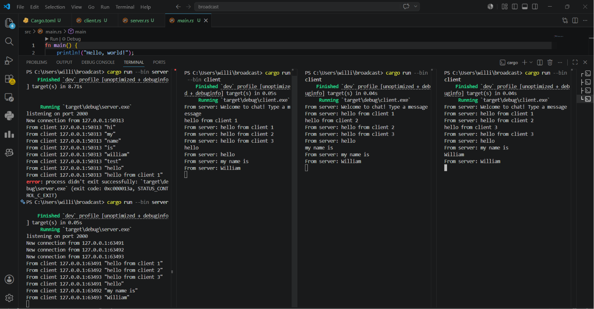

### Experiment 2.1

Untuk menjalankan servernya kita perlu menggunakan command 'cargo run --bin server' dan untuk 3 clientnya dengan 'cargo run --bin client' (masing terminal, 1 instance 1 terminal). Yang terjadi ketika kita memasukan teks ke client 1 adalah teks tersebut akan di teruskan oleh server ke client 2 dan 3, tidak terkecuali client 1.

### Experiment 2.2
Untuk mengubah port yang digunakan, kita perlu memodifikasi dua bagian, yaitu server.rs pada bagian TcpListener::bind dan client.rs pada URI koneksi ws://127.0.0.1:8080. Kedua komponen tersebut tetap menggunakan protokol WebSocket yang sama dan harus mengarah ke port yang identik agar koneksi dapat berhasil dilakukan. Setelah kita mengubah konfigurasi server dan client ke port 8080, program tetap dapat berjalan normal tanpa perubahan perilaku.